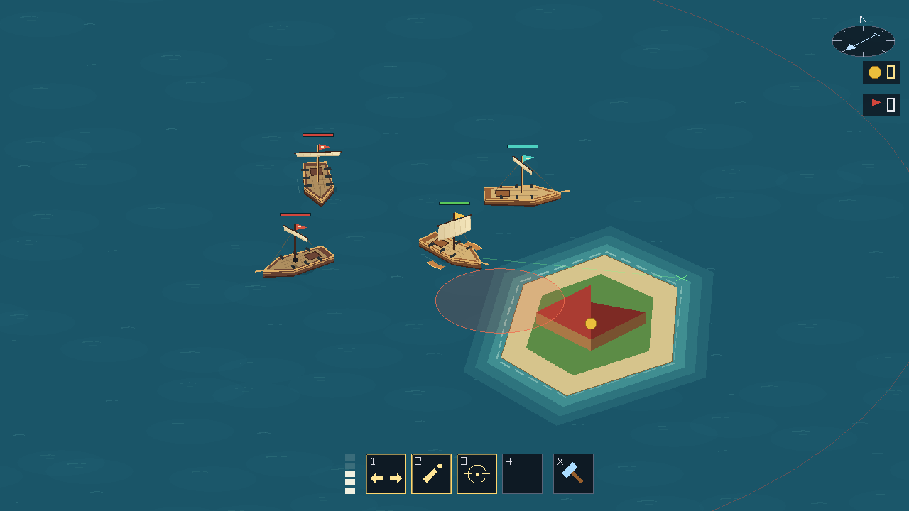
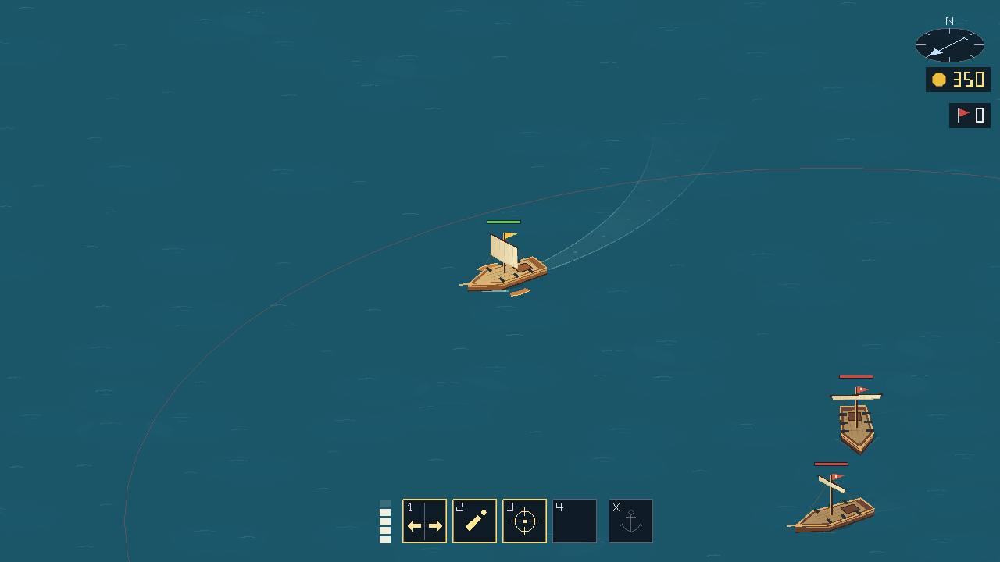
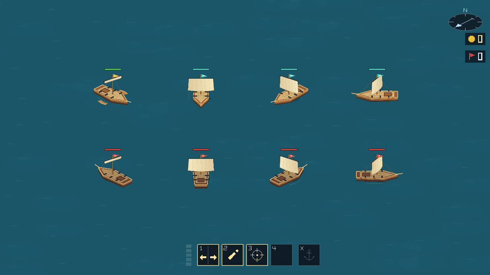

# Visual pass 1: ships and water

The first pass establishes a procedural wooden-ship style with cream sails and blue-green water. It uses existing MonoGame geometry rather than authored art assets.

## Preview

Coast, crew, pirates, and a mortar warning:

A turning ship leaves a curved wake:

Sloops at eight headings, including furled and full sails:

Additional checks: [minimum zoom](visual-pass-1/zoom-out.png), [maximum zoom](visual-pass-1/zoom-in.png), [debug grid below land](visual-pass-1/debug-grid.png), [cargo and firing-lane highlight](visual-pass-1/cargo-targeting.png), [mortar aiming](visual-pass-1/mortar-aim.png).

## Implemented

- Raised decks, shaded hull sides, rail trim, planks, stern hatches, gun barrels, rigging, and bowsprits. The hull waterline follows the existing collision shape.
- Cream sails whose fullness follows the sail setting, furling at anchor. Sails retain a readable width at diagonal headings. Pennants flutter with cosmetic animation.
- Gold pennants for the local player, teal for crew, and red for pirates. Crew health bars are teal; targetable ships receive a warm rim highlight while retaining their material colors.
- Animated wave highlights, quiet ripples around stopped ships, moving bow foam, and trails sampled from interpolated stern positions. Wakes follow turns and coasting, spread and fade over 2.4 seconds, and store at most 32 samples per ship.
- Layered shallow water and animated shoreline foam. The optional debugging grid is disabled during normal play and draws below islands and buildings.
- A small strapped crate on laden ships, drawn beneath the sail. Existing floating cargo, HUD, and targeting markers remain integrated.
- Health and anchor/plunder progress bars moved above the taller rigging.
- Reused triangle/line submission buffers to avoid allocating fresh vertex arrays for every layer flush. Ambient wave generation is restricted to the visible camera area.

## Validation

The client builds without warnings or errors. The existing solution test run passed 208 simulation tests and 115 networking tests.

A temporary capture harness exercised the actual client draw pipeline at 1280×720, 960×540, and 1600×720, both zoom limits, eight headings, crew identity, anchored ships, cargo, firing-lane highlights, and mortar targeting. These are arranged renderer scenes rather than a manual multiplayer playthrough.

Additional checks confirmed that moving trails exist and stay within their sample limit, anchoring expires the ship's wake, replacing the world clears old tracks, and water animation changes between timestamps. Layer ordering was inspected with the debug grid enabled.

Combat effects, island vegetation/landmarks, and the broader HUD/menu/map redesign remain subsequent passes from the [visual audit](visual-audit.md). This pass is ready for an in-game look at the style and motion; sustained multiplayer frame performance has not been profiled.
