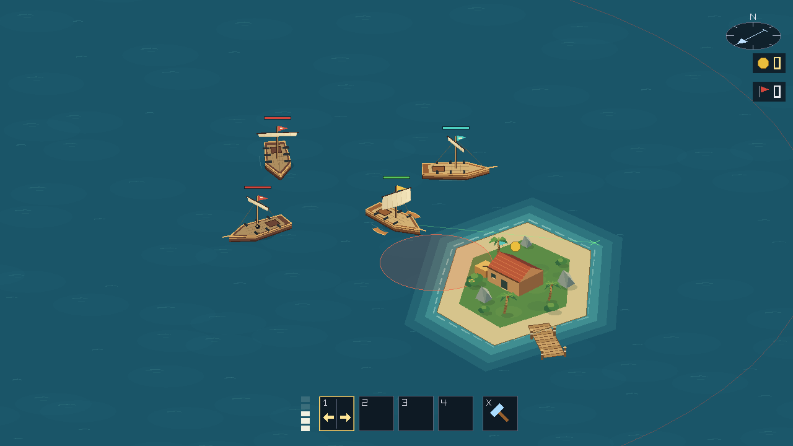
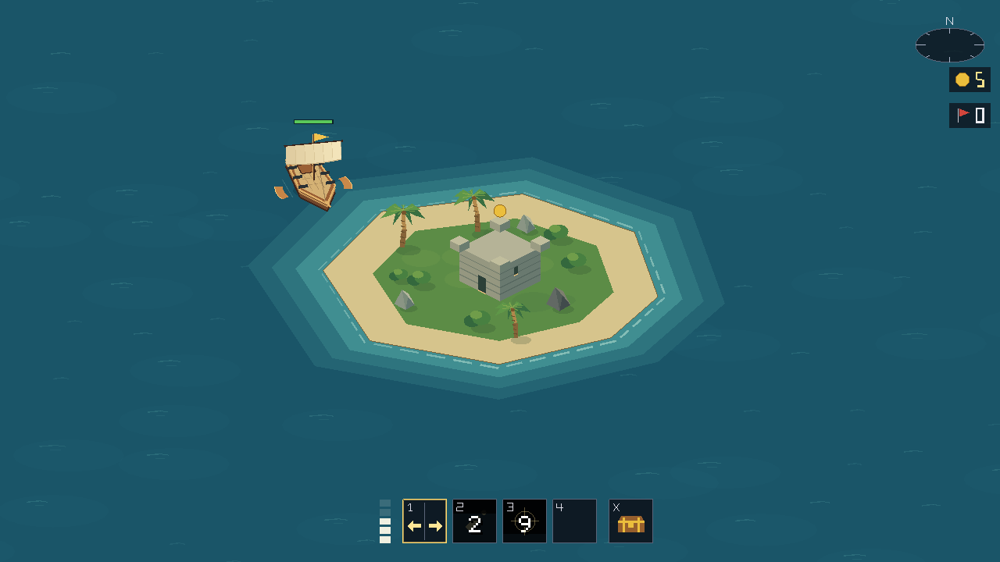
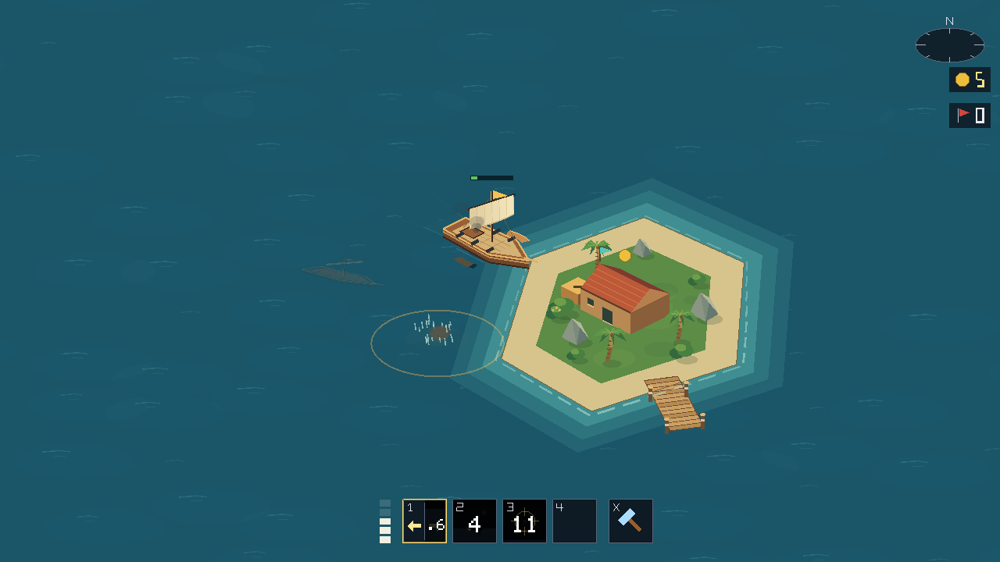

# Visual pass 2: combat and islands

This pass adds procedural island scenery and event-driven combat effects using the same geometry as the ships and water. No authored art assets are required.

## Preview

Palms, shrubs, rocks, a dock, and a shipyard building give the coast more character:

Old Fort has its own landmark:

Mortar impacts throw up spray and an expanding water ring:

More previews: [broadside firing](visual-pass-2/broadside-fire.png), [projectile trails](visual-pass-2/projectile-trails.png), [hull hit](visual-pass-2/hull-hit.png), [sinking](visual-pass-2/sinking-mid.png), [damage smoke](visual-pass-2/damaged-smoke.png), [missed shots](visual-pass-2/missed-shot-splashes.png), [shore impact](visual-pass-2/shore-impact.png).

Island variations: [Salt Key](visual-pass-2/salt-key.png), [Windward beacon](visual-pass-2/windward.png), [Brimstone](visual-pass-2/brimstone.png), [Mangrove](visual-pass-2/mangrove.png). Camera checks: [minimum zoom](visual-pass-2/zoom-out.png), [maximum zoom](visual-pass-2/zoom-in.png), [crowded combat](visual-pass-2/crowded-effects.png).

## Implemented

- Cannon and mortar muzzle flashes and smoke, projectile trails, impact sparks and splinters, brief hull flashes, and smoke from badly damaged ships.
- Water splashes for missed shots, debris for shoreline hits, and mortar spray with expanding impact rings.
- A short sinking animation retains the ship after its simulation entity is removed, tilts and lowers it, and fades it away with debris and spray.
- Cached poses and projectile positions connect effects to simulation events, including multiplayer removal, piercing shots, upgraded broadsides, and mortar clusters.
- Deterministic island vegetation and rocks, swaying palms, grass patches, wooden piers, mooring posts, storage crates, and gabled shipyard buildings.
- Distinct fort, ruin, beacon, volcanic rock, and mangrove scenery. Raised scenery, ships, and sinking wrecks share depth sorting. Island labels and progress markers sit above landmarks.
- Cosmetic scenery leaves existing land boundaries and collision behavior unchanged. Effects are bounded to 768 particles, 64 rings, and 16 sinking ships; expired effects and old-world state are cleared.

## Validation

The client builds without warnings or errors. The current solution tests passed: 236 simulation tests and 124 networking tests (360 total).

A temporary harness captured the actual client draw pipeline at three window sizes, both zoom limits, and several island and combat scenes. Live simulation events verified firing, hull damage, mortar impacts, sinking, missed-shot splashes, shoreline sparks, piercing hits, and cluster launches. A client-replica check verified sinking effects when a server snapshot has already removed the ship.

Scenery generation reproduced the same 179 placements after rebuilding, and all land-based placements were inside island polygons. Effect-cap, expiry, and world-reset checks passed.

A crowded offscreen rendering check with 24 ships, 768 particles, and 40 rings measured a median draw submission time of 1.40 ms and a 95th percentile of 1.48 ms after warmup. This measures the preview renderer, not full-game multiplayer frame performance. The previews are arranged captures, not a manual multiplayer playthrough.

The HUD, menu, and map are the next category from the [visual audit](visual-audit.md).

## Ability upgrade coverage

The follow-up checks cover both branches and every capstone for Broadside, Long Gun, and Mortar, including each weapon starting on slot one rather than assuming fixed keys.

- Broadside muzzle counts follow Heavy Volley, Rapid Guns, and Devastating Volley. Port and starboard effects use the cast's cooldown channel.
- Long-gun aiming follows upgraded range from the muzzle. Piercing shots retain impact feedback at both targets; speed, damage, and reload upgrades use the existing projectile and cooldown state.
- Bombardment aiming shows all three landing zones using the same landing-point calculation as firing. Flight warnings follow each shell's actual impact tick.
- Cluster Shell aiming shows the possible bomblet footprint around the primary blast. Exact bomblet directions depend on the strike ID; their individual warnings appear when the main shell bursts.
- Siege Artillery and Heavy Shell enlarge their previews and explosions. Smaller cluster bursts use smaller flashes, debris, and smoke. Cluster launches do not create extra ship muzzle flashes; salvo muzzle direction follows the first shell.

Previews: [cluster footprint](visual-pass-2/cluster-shell-preview.png), [bombardment landing zones](visual-pass-2/bombardment-preview.png), [cluster flight warnings](visual-pass-2/upgraded-cluster-flight.png), [cluster impacts](visual-pass-2/cluster-shell-impact.png), [bombardment impacts](visual-pass-2/bombardment-impact.png), [piercing long gun](visual-pass-2/piercing-shot-preview.png), [rifled long gun](visual-pass-2/rangefinder-preview.png).

Six new integration cases compare predicted mortar landing points with actual launch events across both upgraded branches, two ship headings, and out-of-range aim points. The solution now passes 242 simulation tests and 124 networking tests (366 total). The rendering harness also verified upgraded muzzle counts, weapon dispatch from different keys, all three bombardment impacts, and the primary blast plus four cluster impacts.

## Cargo rotation fix

The stern cargo crate now uses the ship's forward and sideways axes for all four corners, so its body and strap turn with the hull. Visible side faces are selected after rotation. Verified through the actual renderer at [eight ship headings](visual-pass-2/cargo-headings.png).
